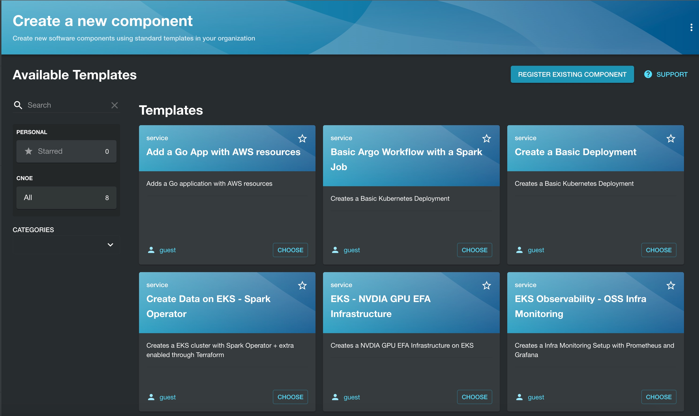
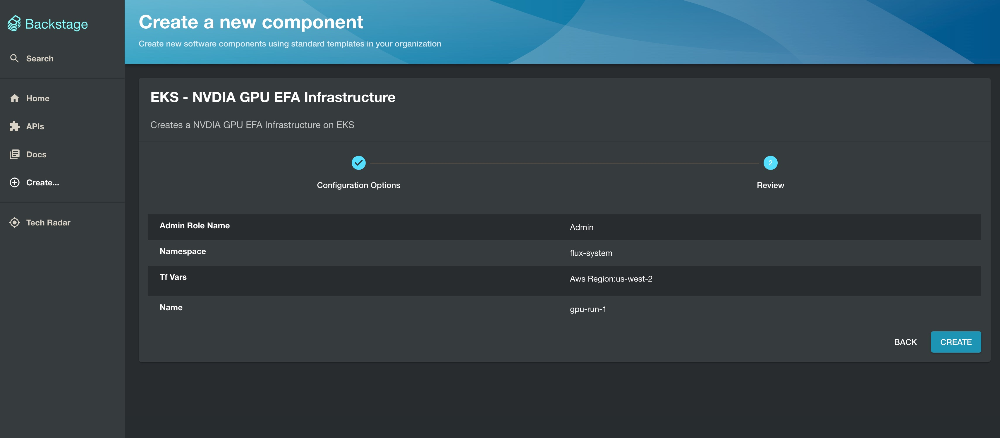
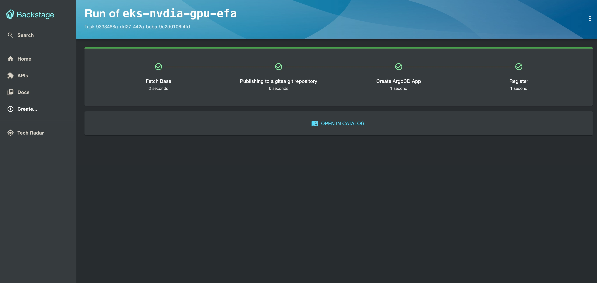
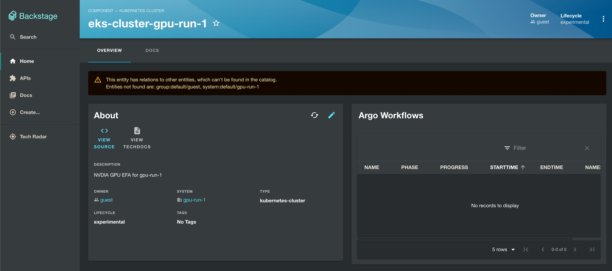
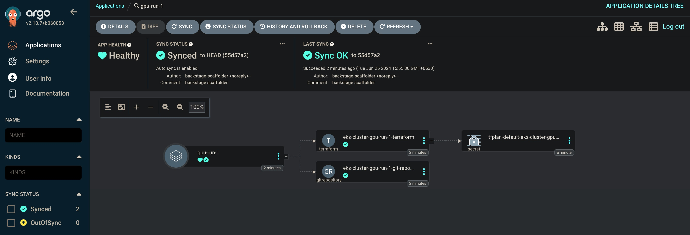
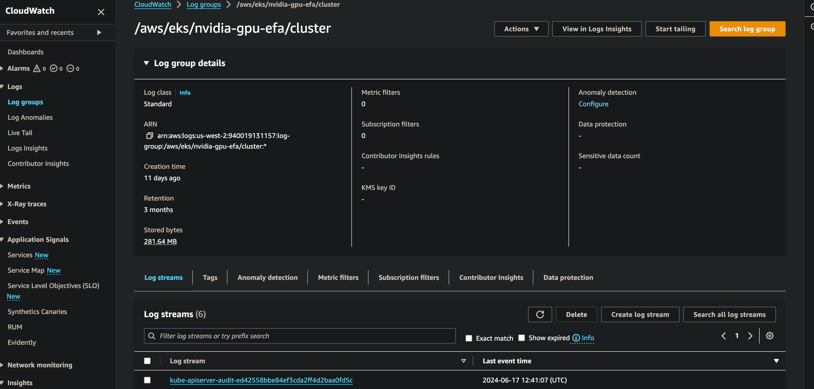

# EKS Cluster w/ NVIDIA GPUs and EFA for Machine Learning

This pattern demonstrates an Amazon EKS Cluster with an EFA-enabled nodegroup that utilizes `p5.48xlarge` instances with H100 NVIDIA GPUs used in distributed, multi-node machine learning workloads.
This pattern implements a terraform integration of AWS-maintained open-source [NVDIA GPU EFA](https://github.com/aws-ia/terraform-aws-eks-blueprints/tree/main/patterns/nvidia-gpu-efa) terraform code in our EKS Terraform Blueprints to deploy them via Backstage. 

## Deployment

Once you are done with setting up [backstage-terraform-integrations](https://github.com/cnoe-io/backstage-terraform-integrations), navigate to [Backstage](https://cnoe.localtest.me:8443/) and click on `create` in the left pane to view the list of available platform templates and click `Choose` on the **EKS - NVIDA GPU EFA Infrastructure** pattern as shown below:



Next, populate the terraform variables for the pattern deployment as shown below and click `Review`:


Next, validate the entered variables in the below confirmation screen and click `Create` :



Next, check on the steps of backstage template run as show below and click `Open In Catalog`:



Next, check on the below screen showing the created Backstage component and click `View Source` to navigate to the Gitea repository:



Next, check on the Gitea repo of the created component as shown below:


Next, Navigate to [ArgoCD](https://cnoe.localtest.me:8443/argocd) console and navigate to Argo App by name `gpu-run-1`to view the below screen:



## Validation

Next, lets validate the execution of the pattern by tofu controller. Run the below command on your terminal to check on `terraforms.infra.contrib.fluxcd.io ` resource:

```bash
> kubectl get terraforms.infra.contrib.fluxcd.io -A

NAMESPACE     NAME                              READY     STATUS     AGE
flux-system   eks-cluster-gpu-run-1-terraform   Unknown   Applying   2m38s
```
Next, lets check on the Kubernetes pod in the `flux-system` namespace which executes the terraform code :

```bash
> kubectl get pods -n flux-system

NAME                                        READY   STATUS    RESTARTS        AGE
eks-cluster-gpu-run-1-terraform-tf-runner   1/1     Running   0               3m3s
source-controller-5cc77697dc-n67pg          1/1     Running   4 (5d20h ago)   11d
tf-controller-865d5c9bbc-sm89l              1/1     Running   4 (5d20h ago)   11d
```

Next, lets check on the logs of this `eks-cluster-gpu-run-1-terraform-tf-runner`as shown below:

```bash
> kubectl logs eks-cluster-gpu-run-1-terraform-tf-runner -n flux-system

Terraform has been successfully initialized!
{"level":"info","ts":"2024-06-25T10:43:53.458Z","logger":"runner.terraform","msg":"workspace select"}
{"level":"info","ts":"2024-06-25T10:43:53.465Z","logger":"runner.terraform","msg":"creating a plan","instance-id":"168115a0-dd43-4957-9d29-67ba85111969"}
{"level":"info","ts":"2024-06-25T10:44:05.284Z","logger":"runner.terraform","msg":"save the plan","instance-id":"168115a0-dd43-4957-9d29-67ba85111969"}
{"level":"info","ts":"2024-06-25T10:44:05.310Z","logger":"runner.terraform","msg":"loading plan from secret","instance-id":"168115a0-dd43-4957-9d29-67ba85111969"}
{"level":"info","ts":"2024-06-25T10:44:05.321Z","logger":"runner.terraform","msg":"running apply","instance-id":"168115a0-dd43-4957-9d29-67ba85111969"}
module.eks.aws_cloudwatch_log_group.this[0]: Creating...
module.eks.module.kms.aws_kms_alias.this["cluster"]: Creating...
```

Lets wait for 20 mins for the `terraform apply` to be completed fully by the tofu controller and lets navigate to Amazon CloudWatch console to view logs from our NVDIA GPU EKS Cluster:



## Delete Workflow

Please follow the following steps if you are looking to delete `gpu-run-1` component created using the backstage terraform integrations. The `Terraform` resources in this repo are configured to clean up the corresponding cloud resources. When the Argo CD application is deleted, the deletion hook for cloud resources kicks in (takes a little bit of time though).

1. In your [argocd](https://cnoe.localtest.me:8443/argocd) console, naviagate to `gpu-run-1` application created for your component and delete it manually.
1. In your [gitea](https://cnoe.localtest.me:8443/gitea/) console, navigate to the `gpu-run-1` repository for your component and delete it manually under settings.
1. Finally in your backstage console, navigate to `gpu-run-1` component and click on `unregister component` to remove the deleted component from backstage.


